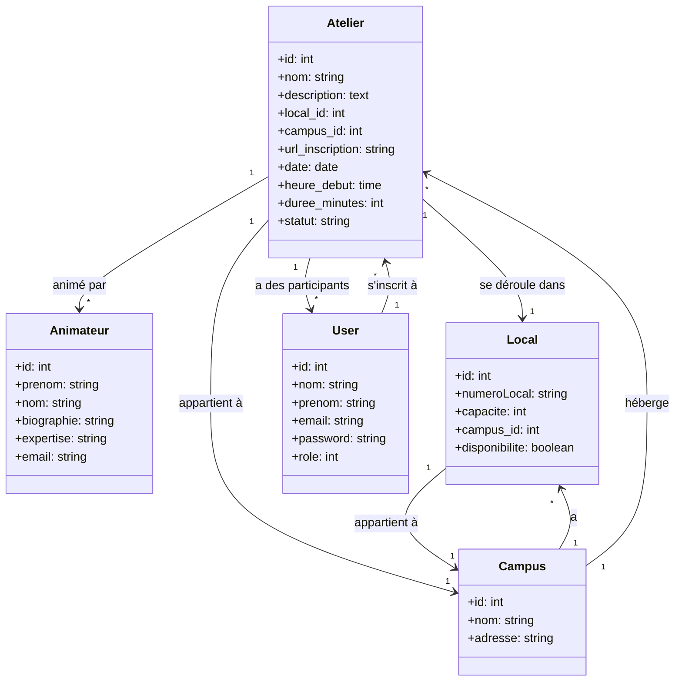

# Gestion des Horaires — Semaine des Sciences Humaines

Application web Laravel permettant la planification et la gestion des horaires de la Semaine des Sciences Humaines, en tenant compte des locaux, des campus et des disponibilités.

---

## Table des matières

- [Aperçu](#aperçu)
- [Fonctionnalités](#fonctionnalités)
- [Prérequis](#prérequis)
- [Installation](#installation)
- [Configuration de la base de données (SQLite)](#configuration-de-la-base-de-données-sqlite)
- [Rôles et permissions](#rôles-et-permissions)
- [Modèle de données](#modèle-de-données)
- [Auteurs](#auteurs)

---

## Aperçu

Ce projet permet aux organisateurs de créer et gérer l'horaire des ateliers directement sur le site d'inscription de la Semaine des Sciences Humaines. Il offre également une page publique pour afficher l'horaire complet par jour et par campus.

---

## Fonctionnalités

**Horaire global**
Visualisation complète des ateliers, affichés par jour et par campus.

**Ateliers**
Liste, création, modification et suppression d'ateliers avec gestion des conflits d'horaires et des locaux disponibles. Filtrage par campus, date et nom. Chaque atelier inclut : nom, animateur(s), description, campus, local, date, heure de début, durée et URL d'inscription.

**Animateurs**
Liste, création, modification et suppression d'animateurs. Filtrage par nom. Chaque animateur inclut : prénom, nom, biographie, expertise et courriel.

**Locaux**
Liste, création, modification et suppression de locaux. Filtrage par campus et disponibilité. Chaque local inclut : numéro, capacité, campus et disponibilité.

**Inscription aux ateliers**
Système d'inscription pour les participants.

**Utilisateurs**
Liste des utilisateurs avec nom, courriel et rôle. Modification des rôles selon les permissions.

---

## Prérequis

- PHP >= 8.2
- Composer
- Node.js & npm
- SQLite (inclus avec PHP)

---

## Installation

**1. Cloner le dépôt**

```bash
git clone https://github.com/votre-utilisateur/gestion_des_horaires.git
cd gestion_des_horaires
```

**2. Installer les dépendances PHP**

```bash
composer install
```

**3. Installer les dépendances JavaScript**

```bash
npm install && npm run build
```

**4. Copier le fichier d'environnement**

```bash
cp .env.example .env
```

**5. Générer la clé d'application**

```bash
php artisan key:generate
```

---

## Configuration de la base de données (SQLite)

Ce projet utilise **SQLite** comme base de données. Étant donné que le fichier de base de données n'est pas inclus dans le dépôt Git, vous devez le créer manuellement.

**Étape 1 — Créer le fichier SQLite**

Dans le dossier `database/` du projet, créez un fichier vide nommé `database.sqlite` :

```bash
# macOS / Linux
touch database/database.sqlite

# Windows (PowerShell)
New-Item -Path "database\database.sqlite" -ItemType File
```

Vous pouvez aussi le créer manuellement via votre explorateur de fichiers : naviguez dans le dossier `database/` et créez un fichier nommé `database.sqlite`.

**Étape 2 — Configurer le fichier `.env`**

Ouvrez le fichier `.env` et assurez-vous que la configuration de la base de données est la suivante :

```env
DB_CONNECTION=sqlite
DB_DATABASE=/chemin/absolu/vers/votre/projet/database/database.sqlite
```

> **Important :** Le chemin doit être **absolu**. Par exemple :
> - Windows : `DB_DATABASE=C:\Users\VotreNom\PhpstormProjects\gestion_des_horaires\database\database.sqlite`
> - macOS/Linux : `DB_DATABASE=/Users/votreNom/projets/gestion_des_horaires/database/database.sqlite`

Assurez-vous également que ces lignes ne sont **pas** présentes ou sont commentées (elles ne sont pas nécessaires pour SQLite) :

```env
# DB_HOST=127.0.0.1
# DB_PORT=3306
# DB_USERNAME=root
# DB_PASSWORD=
```

**Étape 3 — Migrer et alimenter la base de données**

```bash
php artisan migrate:fresh --seed
```

Cette commande crée toutes les tables et insère les données de test.

**Comptes de test créés par le seeder :**

| Courriel                              | Mot de passe | Rôle         |
|---------------------------------------|--------------|--------------|
| organisateur@cegep.qc.ca              | password     | Organisateur |
| admin@cegep.qc.ca                     | password     | Admin        |
| julie.savard@etudiant.cegep.qc.ca     | password     | Utilisateur  |
| mathieu.cote@etudiant.cegep.qc.ca     | password     | Utilisateur  |

**Étape 4 — Lancer le serveur de développement**

```bash
php artisan serve
```

L'application sera accessible à l'adresse [http://localhost:8000](http://localhost:8000).

---

## Rôles et permissions

| Action                          | Organisateur | Admin | Utilisateur |
|---------------------------------|:------------:|:-----:|:-----------:|
| Voir la liste des ateliers      | ✓            | ✓     | ✓           |
| Créer un atelier                | ✓            | ✓     |             |
| Modifier un atelier             | ✓            | ✓     |             |
| Supprimer un atelier            | ✓            |       |             |
| Voir la liste des animateurs    | ✓            | ✓     |             |
| Créer un animateur              | ✓            | ✓     |             |
| Modifier un animateur           | ✓            | ✓     |             |
| Supprimer un animateur          | ✓            |       |             |
| Voir la liste des locaux        | ✓            | ✓     |             |
| Créer un local                  | ✓            | ✓     |             |
| Modifier un local               | ✓            | ✓     |             |
| Supprimer un local              | ✓            |       |             |
| Voir la liste des utilisateurs  | ✓            | ✓     |             |
| Modifier un utilisateur         | ✓ *          | ✓ **  |             |

\* L'organisateur peut modifier un utilisateur seulement s'il n'est pas lui-même organisateur.  
\*\* L'admin peut modifier un utilisateur seulement s'il est de rôle utilisateur.

---

## Modèle de données



